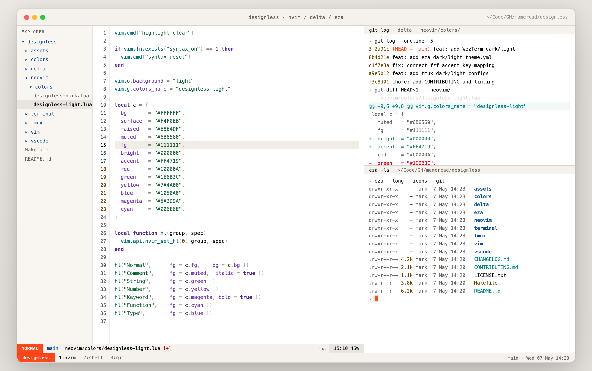
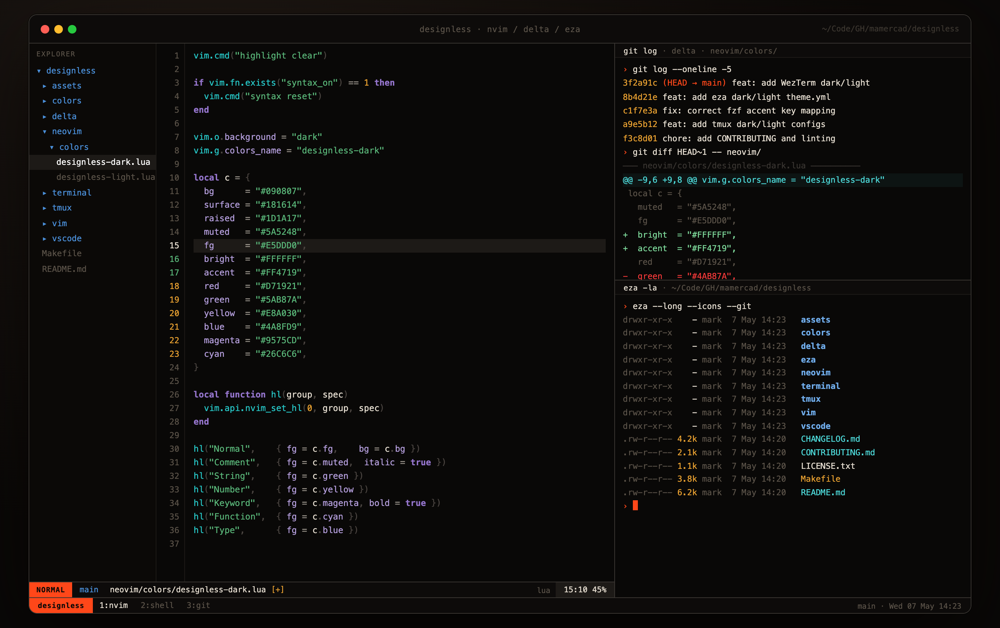

<picture>
  <source media="(prefers-color-scheme: dark)" srcset="assets/logo-dark-xl.svg">
  
</picture>

# Designless Theme

Designless is a warm-monochrome design system for building cohesive themes across multiple platforms: VS Code, terminal emulators (Ghostty, iTerm, Kitty), editors (Vim, Neovim), and more.

## Design Principles

- **Warm Monochrome First**: Strong typography, restrained chrome, grounded in warm grays and blacks
- **One Accent Color**: Molten orange (#FF4719) reserved for active or focused states only
- **Structure Over Decoration**: Syntax color clarifies code structure, never adds ornament
- **Terminal Integration**: ANSI colors match the wider Designless workstation palette

## Targets

| Target | Status | Location |
|--------|--------|----------|
| VS Code | ✅ Complete | [vscode/](vscode/) |
| **Terminal Emulators** | | [terminal/](terminal/) |
| Ghostty | ✅ Complete | [terminal/ghostty/](terminal/ghostty/) |
| iTerm2 | ✅ Complete | [terminal/iterm2/](terminal/iterm2/) |
| Kitty | ✅ Complete | [terminal/kitty/](terminal/kitty/) |
| WezTerm | ✅ Complete | [terminal/wezterm/](terminal/wezterm/) |
| Alacritty | ✅ Complete | [terminal/alacritty/](terminal/alacritty/) |
| **TUI Tools** | | |
| tmux | ✅ Complete | [tmux/](tmux/) |
| delta | ✅ Complete | [delta/](delta/) |
| eza | ✅ Complete | [eza/](eza/) |
| lazygit | ✅ Complete | [lazygit/](lazygit/) |
| fzf | ✅ Complete | [fzf/](fzf/) |
| **Editors** | | |
| Neovim | ✅ Complete | [neovim/](neovim/) |
| Vim | ✅ Complete | [vim/](vim/) |

## Terminal Screenshots

Sample renders of the Designless terminal variants, including ANSI 0-15 and key structural/state colors (background, foreground, muted, accent, selection):

### Light Variant



### Dark Variant



## Quick Start

### VS Code

See [vscode/README.md](vscode/README.md) for installation and development instructions.

### Installation via Make

The repository includes a `Makefile` to automate deployment across all supported tools. Before installing, snapshot your current configuration:

```sh
cd /path/to/designless
make backup      # Snapshot existing config
make install     # Deploy all 24 Designless theme files
```

To restore from a backup later:

```sh
make restore
```

You can also install only one variant:

```sh
make install-light     # Deploy only light themes
make install-dark      # Deploy only dark themes
```

`Makefile` respects `XDG_CONFIG_HOME` for install and restore paths, and falls back to `~/.config` when unset.

You can print recommended environment exports for each variant:

```sh
make env-light
make env-dark

# Apply in current shell session
eval "$(make env-light)"
# or
eval "$(make env-dark)"
```

#### Deployment Map

The `install` target copies **24 files** across 12 tools to canonical config locations.
In the table below, `~/.config` means `XDG_CONFIG_HOME` when set, otherwise `~/.config`.

| # | Source | Destination |
|----|--------|-------------|
| 1 | `terminal/ghostty/designless-light` | `~/.config/ghostty/themes/designless-light` |
| 2 | `terminal/ghostty/designless-dark` | `~/.config/ghostty/themes/designless-dark` |
| 3 | `terminal/iterm2/designless-light.json` | `~/Library/Application Support/iTerm2/DynamicProfiles/designless-light.json` |
| 4 | `terminal/iterm2/designless-dark.json` | `~/Library/Application Support/iTerm2/DynamicProfiles/designless-dark.json` |
| 5 | `terminal/kitty/designless-light.conf` | `~/.config/kitty/colors/designless-light.conf` |
| 6 | `terminal/kitty/designless-dark.conf` | `~/.config/kitty/colors/designless-dark.conf` |
| 7 | `terminal/alacritty/designless-light.yml` | `~/.config/alacritty/colors/designless-light.yml` |
| 8 | `terminal/alacritty/designless-dark.yml` | `~/.config/alacritty/colors/designless-dark.yml` |
| 9 | `terminal/wezterm/designless-light.toml` | `~/.config/wezterm/colors/designless-light.toml` |
| 10 | `terminal/wezterm/designless-dark.toml` | `~/.config/wezterm/colors/designless-dark.toml` |
| 11 | `delta/designless-light.gitconfig` | `~/.config/delta/themes/designless-light.gitconfig` |
| 12 | `delta/designless-dark.gitconfig` | `~/.config/delta/themes/designless-dark.gitconfig` |
| 13 | `eza/light/theme.yml` | `~/.config/eza/light/theme.yml` |
| 14 | `eza/dark/theme.yml` | `~/.config/eza/dark/theme.yml` |
| 15 | `fzf/designless-light` | `~/.config/fzf/designless-light` |
| 16 | `fzf/designless-dark` | `~/.config/fzf/designless-dark` |
| 17 | `lazygit/designless-light.yml` | `~/.config/lazygit/themes/designless-light.yml` |
| 18 | `lazygit/designless-dark.yml` | `~/.config/lazygit/themes/designless-dark.yml` |
| 19 | `tmux/designless-light.conf` | `~/.config/tmux/designless-light.conf` |
| 20 | `tmux/designless-dark.conf` | `~/.config/tmux/designless-dark.conf` |
| 21 | `neovim/colors/designless-light.lua` | `~/.config/nvim/colors/designless-light.lua` |
| 22 | `neovim/colors/designless-dark.lua` | `~/.config/nvim/colors/designless-dark.lua` |
| 23 | `vim/colors/designless-light.vim` | `~/.vim/colors/designless-light.vim` |
| 24 | `vim/colors/designless-dark.vim` | `~/.vim/colors/designless-dark.vim` |

Backups are stored in `backups/YYYYMMDD-HHMMSS/` and are git-ignored.

#### Post-Installation Setup

`make install` deploys the theme files but does not activate them. You must configure each app to use Designless:

| Tool | Configuration |
|------|----------------|
| **VS Code** | Install the [Designless extension](vscode/README.md); themes auto-register |
| **Ghostty** | `~/.config/ghostty/config` → `theme = "designless-dark"` (or `designless-light`) |
| **iTerm2** | Preferences → Profiles → Colors → Load preset "designless-dark" or "designless-light" |
| **Kitty** | `~/.config/kitty/kitty.conf` → `include ~/.config/kitty/colors/designless-dark.conf` |
| **Alacritty** | `~/.config/alacritty/alacritty.yml` → `import: [~/.config/alacritty/colors/designless-dark.yml]` |
| **WezTerm** | `~/.config/wezterm/wezterm.lua` → `config.color_scheme = "designless-dark"` |
| **tmux** | `~/.config/tmux/tmux.conf` → `source-file ~/.config/tmux/designless-dark.conf` |
| **delta** | `~/.config/git/config` → `[delta]` section → `features = designless-dark` |
| **eza** | Handled via `.zshrc` (`EZA_CONFIG_DIR` auto-selects light/dark) |
| **lazygit** | `~/.config/lazygit/config.yml` → `gui:` → `theme: "designless-dark"` |
| **fzf** | `~/.zshrc` or `~/.bashrc` → `source ~/.config/fzf/designless-dark` |
| **Neovim** | `~/.config/nvim/init.lua` → `vim.cmd.colorscheme("designless-dark")` |
| **Vim** | `~/.vimrc` → `colorscheme designless-dark` |

### Adding a New Target

See [docs/ARCHITECTURE.md](docs/ARCHITECTURE.md) for guidance on building new theme targets using the shared color definitions in `colors/`.

## Color Definitions

Shared color palettes live in `colors/`:

- [designless-light.json](colors/designless-light.json) — Light variant
- [designless-dark.json](colors/designless-dark.json) — Dark variant

Each includes palette values, semantic token colors, and terminal ANSI color sets.

## Source & Philosophy

The palette and design philosophy come from the 2ndBrain wiki: [`wiki/designless.md`](https://github.com/mamercad/2ndBrain/blob/main/wiki/designless.md).

## Contributing

See [CONTRIBUTING.md](CONTRIBUTING.md) for development workflow, commit conventions, and guidelines.

This project follows [Conventional Commits](https://www.conventionalcommits.org/). All commits must pass local linting:

```bash
make lint              # Validate JSON, YAML, Markdown
```

## License

MIT. See [LICENSE.txt](LICENSE.txt).
